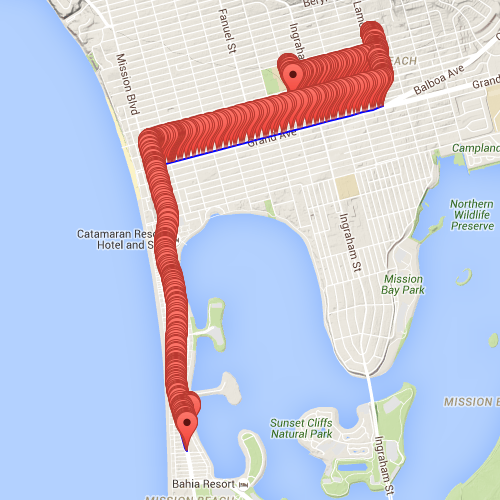

OBD-Dos
=======

Introduction
------------

OBD-Dos is a platform used for collecting metadata from a vehicle's [OBD-II port](https://en.wikipedia.org/wiki/On-board_diagnostics) along with [GPS](https://en.wikipedia.org/wiki/Global_Positioning_System) information to be used for extracting useful information about an individual's driving habits, and to make educated decisions about what the best routes and times to travel are.

OBD-II provides information such as [vehicle's speed, engine performance, and other useful information](https://en.wikipedia.org/wiki/OBD-II_PIDs). GPS can provide information such as current time, latitude, longitude, and heading. These combined data points can then be mapped and analyzed to show information about how efficient different trips are.

Here is a screenshot of some sample data points that were collected with an early version of the software:




Hardware Components
-------------------

* [Arduino Uno](https://www.arduino.cc/en/Main/arduinoBoardUno)
* [Arduino CAN-bus Shield](https://www.sparkfun.com/products/10039)
   * [MCP2515 CAN Controller](http://www.microchip.com/wwwproducts/devices.aspx?dDocName=en010406)
   * [EM-506 GPS Receiver](https://www.sparkfun.com/products/12751)
* [OBD-II to DB9 Cable](https://www.sparkfun.com/products/10087)
* [Serial Bluetooth Transceiver](http://www.amazon.com/dp/B00OLL9XH0)


Arduino Port Mapping
--------------------

* RX - Serial Bluetooth Transceiver TX
* TX - Serial Bluetooth Transceiver RX
* D2 - MCP2515 INT
* D3 -
* D4 - EM-506 GPS Receiver TX
* D5 - EM-506 GPS Receiver RX
* D6 -
* D7 - Arduino CAN-bus Shield Green LED 0
* D8 - Arduino CAN-bus Shield Green LED 1
* D9 -
* D10 - MCP2515 CSN
* D11 - MCP2515 MOSI
* D12 - MCP2515 MISO
* D13 - MCP2515 CLK


How to Build & Install Firmware (Windows)
-----------------------------------------

1. Install latest version of [Arduino software](https://www.arduino.cc/en/Main/Software) (for Arduino and AVR libraries)
2. Install latest version of [MinGW](http://www.mingw.org/)
3. ```mingw32-make``` to build
4. ```mingw32-make install``` to download to Arduino Uno (change COM_PORT in Makefile for your system)


Firmware 1.0.0 Requirements
---------------------------

- [x] EM-506 GPS receiver drivers
- [ ] MCP2515 CAN controller drivers
- [ ] OBD-II drivers
- [x] Serial Bluetooth drivers
- [x] Application code to collect and output sensor data

